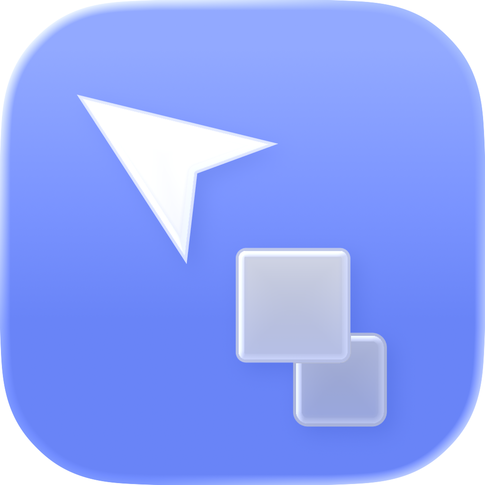

<div align="center">
  
</div>

<h1 align="center">coypa</h1>

<p align="center">
  <b>coypa is a fun way to manage your clipboard.</b><br>
  Copies stack and follow your cursor. Hold paste, they fan out
  into a wheel. Pick one, and it pastes!
</p>

<div align="center">
  
</div>

---

## Install

```sh
brew install sdl3
git clone https://github.com/willmeyers/coypa
cd coypa
./scripts/bundle.sh
open dist/                  # drag coypa.app to /Applications
```

### Grant Accessibility

coypa has to notice the paste key being held **anywhere**, which macOS only
permits through a keyboard event tap:

> **System Settings ▸ Privacy & Security ▸ Accessibility** → add `coypa.app`

Grant it to the **app bundle**, not your terminal — macOS ties this permission
to an app's code-signing identity, so running the bare binary attaches the
grant to whatever launched it.

Without permission coypa still collects copies; only the hold-to-wheel trigger
goes quiet, and ⌘V behaves exactly as normal.
